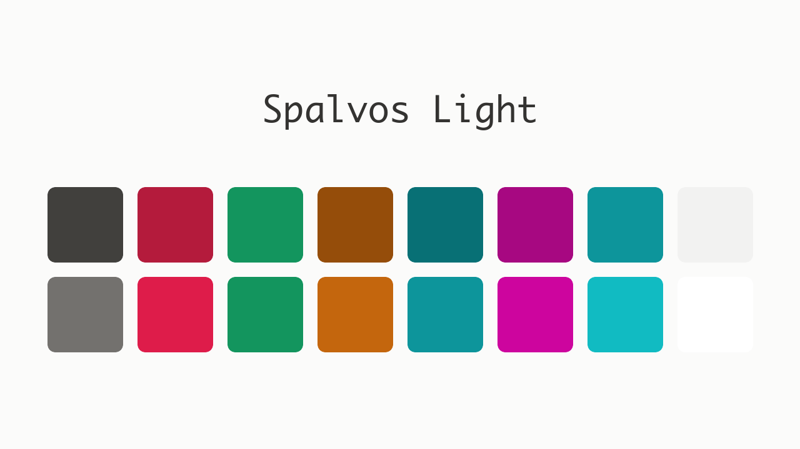
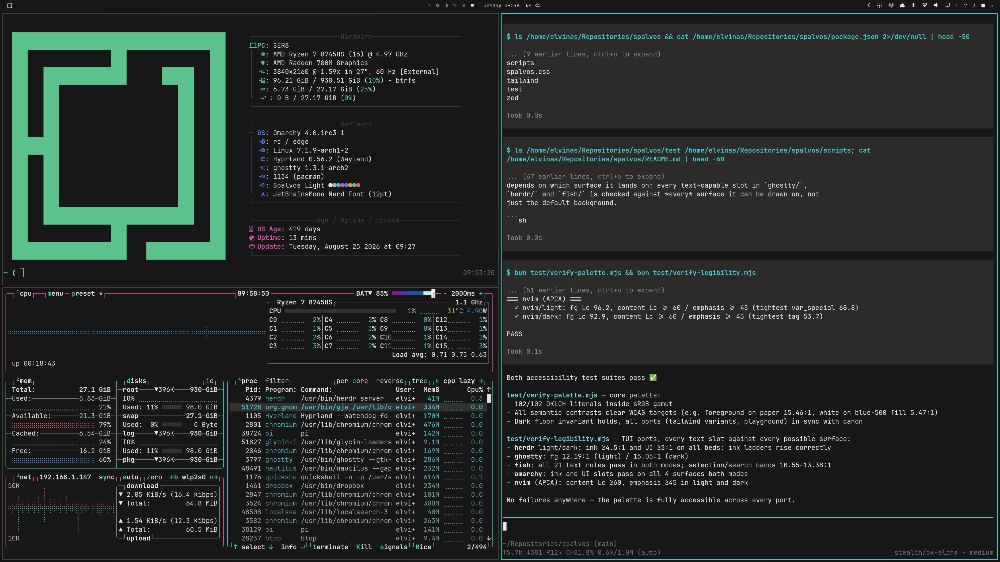
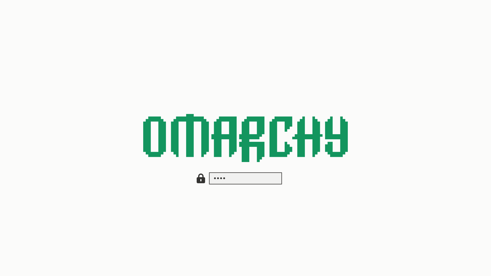
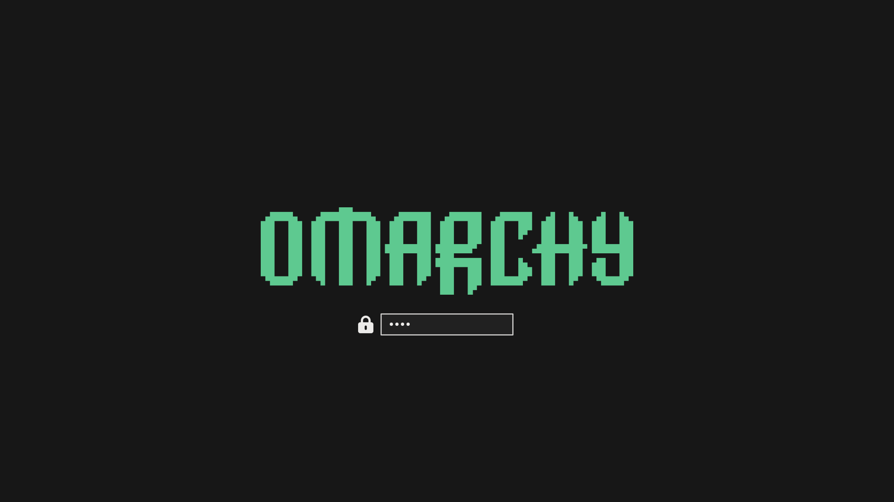

# Spalvos

A transportable color system. Warm ink on warm paper (Flexoki / Helply
lineage), dialed toward neutral — quiet, not cold. One set of OKLCH primitives
drives a light web UI, a dark web UI, a terminal, an editor, and a desktop —
no per-port hand-tweaking.

<a href="LICENSE"></a>
<a href="https://github.com/elvinaspredkelis/spalvos/stargazers"></a>

| Light | Dark |
|-------|------|
|  |  |
|  |  |

## Quickstart

```sh
git clone https://github.com/elvinaspredkelis/spalvos
cd spalvos
bin/spalvos-install
```

Copies each port to where its app reads it and skips anything you don't have.
Pick ports with `bin/spalvos-install pi omarchy`; `--list` shows what's
installed and whether it drifted from the repo.

On Omarchy, skip the clone and install straight from the menu:
[omarchy-spalvos-light](https://github.com/elvinaspredkelis/omarchy-spalvos-light) /
[omarchy-spalvos-dark](https://github.com/elvinaspredkelis/omarchy-spalvos-dark).

## Ports

| Port | Where |
|------|-------|
| Tailwind / CSS | [`spalvos.css`](spalvos.css), packaging variants in [`tailwind/`](tailwind) |
| Omarchy | [`omarchy/`](omarchy) |
| Zed | [`zed/spalvos.json`](zed/spalvos.json) |
| Neovim | [`nvim/`](nvim) |
| Ghostty | [`ghostty/`](ghostty) |
| Fish | [`fish/`](fish) |
| Herdr | [`herdr/`](herdr) |
| Pi | [`pi/`](pi) |

Everything derives from `spalvos.css`. If a colour looks off in a port, fix
the primitive and reconvert — never hand-tweak hexes downstream.

## The core

Six accent ramps (rose, amber, emerald, cyan, blue, magenta) plus one neutral
spine. Themed tokens (`background`, `foreground`, `border`, the semantic
`*-strong` accents, …) reference those primitives; a "theme" is just which
value wins. Light is the default, `[data-theme="dark"]` repoints, and the
ports repoint again.

The invariant that makes dark safe: at the dark end the darkest surface and the
darkest ink are the *same* primitive (`neutral-1000`, the true-black floor), so
a surface can never sink below the ink.

## Verify

Accessibility is asserted, not eyeballed — CI runs both on every push:

```sh
bun test/verify-palette.mjs      # gamut, WCAG semantic contrasts, port provenance
bun test/verify-legibility.mjs   # every ink on every surface it can land on, + APCA
```

`verify-palette` checks that every `oklch()` literal fits sRGB, the key
semantic pairs clear their WCAG targets, and every hex in every port renders a
canon primitive. `verify-legibility` covers the surfaces: in a TUI a colour's
legibility depends on which bed it lands on, so every text-capable slot in
`ghostty/`, `herdr/`, `fish/` and the Omarchy desktop is checked against
*every* surface it can be drawn on — and the editor syntax ink clears APCA Lc
floors in both variants.

### One thing to know before writing a port

The ANSI **white** slots (7/15) are paper *surfaces* at the light end, and the
**black** slots (0/8) are surface tones at the dark end. That is correct ANSI
practice, and it means a TUI must never paint text with them. Consumers that do
— fish's stock theme, Tide, herdr's built-in `terminal` theme — go invisible in
one mode or the other. The fix belongs in the consumer: bending the palette to
suit one of them breaks all the rest.

## Who uses Spalvos

[Primevise](https://primevise.com) · [Rinkta](https://rinkta.com) · [Krowk](https://krowk.com)

## License

MIT — see [`LICENSE`](LICENSE).
